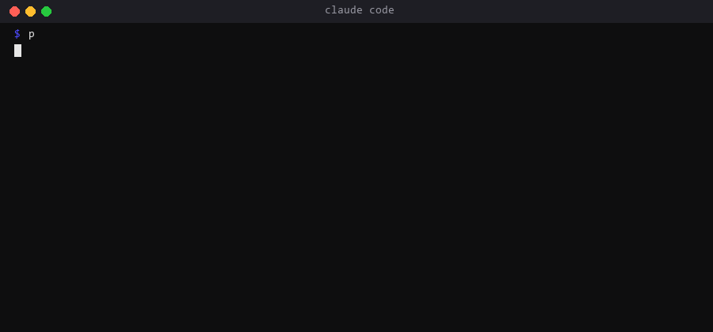

# decision-precedent

A decision memory for agents: search before you ask, store after you decide, report whether the precedent held.

Why it exists: in a company run by agents, the scarce resource is the human's attention. We found the same question reaching the founder twice in one week from two sessions that could not see each other's answers. The rule since then: a question a human already answered is never asked again. This plugin is the mechanism.



## Install

```
/plugin marketplace add ExasyncOU/claude-plugins
/plugin install decision-precedent@exasync-plugins
```

Requires Python 3.10+. The store is a JSON file at `.claude/decisions.json` in your project, so it travels with the repository and works offline. Commit it.

## Use

```
python scripts/decision.py search --domain architecture "own table for threads or reuse todos?"
python scripts/decision.py store --domain architecture --slug threads-vs-todos \
    --question "..." --decision "..." --rationale "..." --by human
python scripts/decision.py feedback --key decisions/architecture/threads-vs-todos --outcome applied
python scripts/decision.py list
python scripts/decision.py show --key decisions/architecture/threads-vs-todos
```

`search` prints a verdict for the best match: `APPLY` (score >= 0.60), `CONTEXT` (0.35 to 0.60) or `WEAK`. Scoring is lexical (weighted token overlap over question, decision, rationale, tags and slug). It is deliberately simple: no model, no network, no surprise. If you want semantic search, point `DECISION_BACKEND_CMD` at your own backend and it receives the same commands.

`feedback` appends an outcome to the decision. Outcomes are never overwritten, so a precedent that keeps getting rejected shows up as one to revisit.

## The escalation ladder the skill teaches

1. Search precedents.
2. Strong match: apply it, then log `applied` or `rejected`.
3. No match and the strategy is clear: the agent decides and stores with `--by agent`.
4. No match and the decision is irreversible, costs money, changes what a customer sees or forks the architecture: ask the human, then store with `--by human`.

## Configuration

| Variable | Effect |
|---|---|
| `DECISION_STORE` | path of the JSON store (default `.claude/decisions.json`) |
| `DECISION_BACKEND_CMD` | command that handles `search`, `store`, `feedback` instead of the JSON store |

## Test

```
python -m pytest tests -q
```
