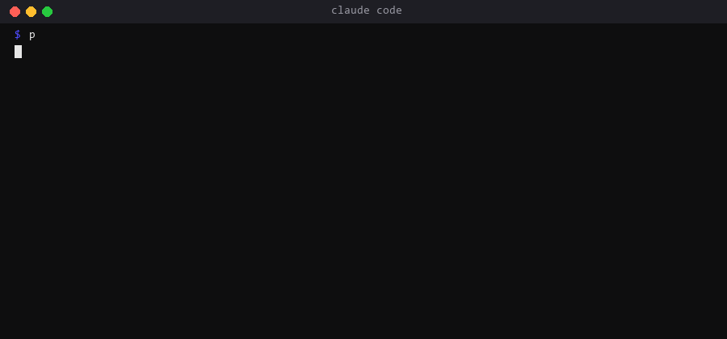

# email-format-guard

A deterministic gate that stops customer-facing email from looking generated.

Why it exists: our outreach and customer pipelines produced email that was correct and still got ignored. The pattern was always the same: an em dash here, a bold line there, a bullet list, a placeholder nobody rendered. Humans do not write like that. The fix was not a better prompt but a gate that fails the send.



## Install

```
/plugin marketplace add exasync/claude-plugins
/plugin install email-format-guard@exasync-plugins
```

Requires Python 3.10+ on PATH. No other dependencies.

## Use

Claude picks the skill up when you ask it to check, send or draft an email. You can also call it directly:

```
python scripts/format_guard.py check --file draft.txt
python scripts/format_guard.py check --text "Hi Anna, ..."
python scripts/format_guard.py scan --dir ./my-pipeline
```

Exit 0 is clean, exit 1 lists findings with line numbers.

What is checked:

| Rule | Example that fails |
|---|---|
| No em or en dash | `we deliver — fast` |
| No formatting in the body | `**Offer**`, `- item`, `<b>`, `# Title`, `style=` |
| No unresolved placeholder | `{{first_name}}`, `[Company]` |
| No team salutation | `Hi all,`, `Hello team,` |
| No double sign-off | two closing formulas in one body |

The signature block (after a `--` line or the first closing formula) may contain formatting. The dash check applies everywhere.

Scan mode walks `.py .ps1 .js .mjs .ts .html` files that contain email context and reports dashes and formatting tags inside string literals. Mark deliberate exceptions with the comment `format-guard-ok`.

## Test

```
python -m pytest tests -q
```
