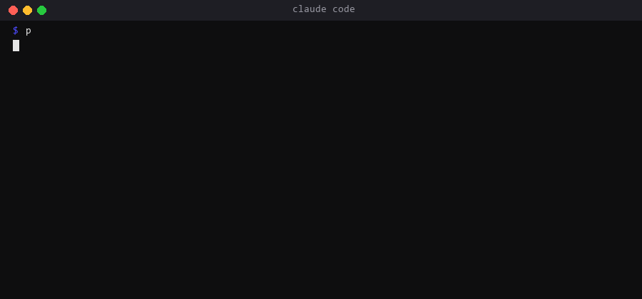

# usage-guard

A hook that keeps a long-running Claude Code session inside its subscription limits. It prints one usage line whenever the numbers move and, past a threshold, denies the expensive commands so the session wraps up with a checkpoint instead of dying mid-batch.

Why it exists: we run several sessions in parallel on one subscription. On a Tuesday the weekly limit was gone by noon because every session kept starting new batch runs until the wall. The guard turned that into a controlled hand-over: at 85 percent no new expensive runs, at 92 percent only checkpoint and handover commands.



## Install

```
/plugin marketplace add exasync/claude-plugins
/plugin install usage-guard@exasync-plugins
```

Requires Python 3.10+ on PATH. The plugin registers two hooks: `UserPromptSubmit` (prints the usage line) and `PreToolUse` for Bash (denies commands past the threshold).

## Feed it

The hook reads only a local status file, `~/.claude/usage-guard/status.json`. It does not call any API and does not touch your credentials. You decide where the numbers come from:

```
python scripts/usage_set.py --session 42 --weekly 61 --account team \
    --session-reset 2026-09-07T10:00:00+00:00 --weekly-reset 2026-09-12T05:00:00+00:00
python scripts/usage_set.py --from-json snapshot.json
python scripts/usage_set.py --show
```

Typical sources: the numbers from `/usage`, a scheduled job that reads your billing dashboard, or a script of your own. If the status is older than `stale_minutes` (default 30) the hook says so in the usage line.

## What you see

```
USAGE team: session 42% (resets 10:00), week 61% (resets Fri 05:00). Stage: NORMAL.
```

| Stage | Condition | Effect on Bash commands |
|---|---|---|
| NORMAL | below thresholds | none |
| PAUSE | session >= 85% or week >= 85% | commands matching `expensive` are denied |
| HARD | session >= 92% | everything is denied except `always_allowed` |

## Configure

Optional `~/.claude/usage-guard/config.json`:

```json
{
  "pause_pct": 85,
  "hard_pct": 92,
  "weekly_cap_pct": 85,
  "stale_minutes": 30,
  "expensive": ["claude\\s+-p", "pytest", "npm\\s+(test|run\\s+build)", "docker\\s+build", "make\\b"],
  "always_allowed": ["^\\s*git\\s+(status|log|diff|rev-parse)", "^\\s*(ls|cat|type|dir|pwd|echo)\\b", "checkpoint", "handover", "status\\.json"]
}
```

Environment overrides: `USAGE_GUARD_STATUS`, `USAGE_GUARD_CONFIG`.

The hook never blocks on its own failure: a missing or broken status file means no output and no denial.

## Test

```
python -m pytest tests -q
```
